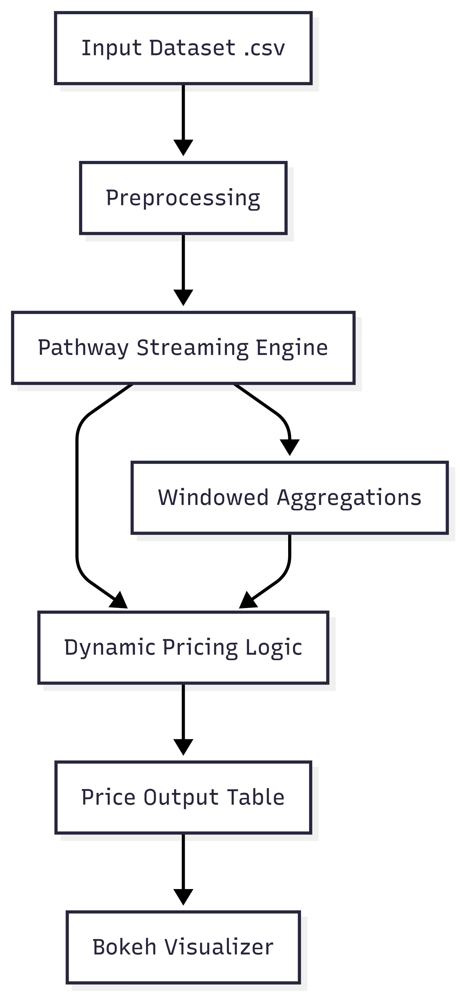

# dynamic-parking-pricing
#  Dynamic Pricing for Urban Parking Lots

### Capstone Project – Summer Analytics 2025  
By Consulting & Analytics Club × Pathway

---

##  Project Overview

Urban parking lots are often inefficiently priced, either overcrowded or underutilized. This project simulates a **real-time, intelligent pricing engine** for 14 parking spaces using streaming data and ML logic.

We implement a multi-stage dynamic pricing model to:
- Adjust parking prices based on **real-time occupancy**, **traffic**, **vehicle type**, etc.
- Visualize dynamic price behavior using **Bokeh**
- Stream data in real time with **Pathway**

---

##  Tech Stack

| Tool       | Purpose                             |
|------------|-------------------------------------|
| `Pathway`  | Real-time streaming + computation   |
| `Pandas`   | Data preprocessing                  |
| `NumPy`    | Math operations                     |
| `Bokeh`    | Interactive price visualization     |
| `Google Colab` | Cloud-based execution environment  |

---

##  System Architecture

